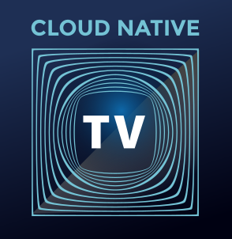

# CloudNative.TV <T>
  

SIG <T> is responsible for:

- Become the definitive interactive media experience for anyone wanting to learn, grow, and collaborate with others in the Cloud Native community from anywhere in the world.

The [SIG <T> charter](/CHARTER.md) outlines the scope of our group activities. To get involved, our [Contributing Guide](/CONTRIBUTING.md) lays out more details.

- [CNCF SIG <T>](#cncf-sig-t)
  - [Meetings](#meetings)
  - [Communicating with Us](#communicating-with-us)
  - [Members](#members)
    - [SIG Chairs](#sig-chairs)
    - [TOC Liaisons](#toc-liaisons)
    - [Bootstrap SIG members](#bootstrap-sig-members)
  - [Working Groups](#working-groups)
    - [Cloud Native TV](#cloud-native-tv)

## Meetings

The <T> Special Interest Group meets biweekly on Tuesday at
17:30 UTC (see your timezone [here](https://time.is/compare/1730_09_Mar_2021_in_UTC)):

- Calendar invites are manual for now, please reach out to david@rawkode.com for an invitation.

## Communicating with Us

Anyone is welcome to join our open discussions of SIG <T>
projects and share news related to the group's mission and charter.

- No mailing list yet
- No Slack channel yet
- [File an Issue](https://github.com/cncf/cloudnativetv)

## Members

### SIG Chairs

- Kat Cosgrove ([@katcosgrove](https://github.com/katcosgrove)) , jfrog
- POP ([@danpopsd](https://github.com/danpopsd)), Sysdig

### Program Oversight Committee

TBC

### Bootstrap SIG members

- David McKay ([@rawkode](https://github.com/rawkode)), Equinix Metal
- POP ([@danpopsd](https://github.com/danpopsd)), Sysdig
- Kat Cosgrove ([@katcosgrove](https://github.com/katcosgrove)) , jfrog
- Leonardo Murillo ([@murillodigital](https://github.com/murillodigital)), Cloud Native Architects

## Working Groups

### Cloud Native TV

[Charter](/wg-tv/README.md)

Facilitators:

- POP ([@danpopsd](https://github.com/danpopsd)), Sysdig
