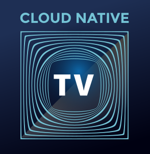

# CloudNative.TV <T>
  
The CNCF's definitive interactive media experience for anyone wanting to learn, grow, and collaborate with others in the Cloud Native community from anywhere in the world.
CloudNative.tv is currently community run shows livestreaming on Twitch with a variety of hosts show casing different aspects of the cloud native community.

- [FAQ](https://github.com/cncf/cloudnativetv/blob/main/FAQ.md)
- [Meetings](#meetings)
- [CloudNative.tv Operations](#cloudnativetv-operations)
- [Launch Shows](#launch-shows)
- [Communicating with Us](#communicating-with-us)
- [Governance](https://github.com/cncf/cloudnativetv/blob/main/governance.md)
- [Members](#members)
  - [SIG Chairs](#sig-chairs)
  - [Bootstrap SIG members](#bootstrap-sig-members)
- [Working Groups](#working-groups)
  - [Cloud Native TV](#cloud-native-tv)

## Meetings

The Special Interest Group meets biweekly on Tuesday at
17:30 UTC (see your timezone [here](https://time.is/compare/1730_09_Mar_2021_in_UTC)):

- Calendar invites are manual for now, please reach out to david@rawkode.com for an invitation.

## CloudNative.TV Operations
- [Scheduling](./scheduling.md)
- [Channel Guide](https://github.com/cncf/cloudnativetv/blob/main/operations/channel-guide.md)
- [Show and Twitch Operations Guide](https://github.com/cncf/cloudnativetv/blob/main/operations/show-guidelines.md)
- [Show Selection Process](https://github.com/cncf/cloudnativetv/blob/main/operations/submission-process.md) 
- [Metrics](./metrics.md)
- [Archived Content](https://github.com/cncf/cloudnativetv/blob/main/operations/archived-content.md)
- [Contributing](https://github.com/cncf/cloudnativetv/blob/main/CONTRIBUTING.md)

## Current Shows
- [Art as Code](./shows/ArtAsCode.md)
- [Certs Magic](./shows/certsmagic.md)
- [.edYOU](./shows/edYOU.md)
- [CNCFaceoff](./shows/cncfaceoff.md)
- [Fields Tested](./shows/fieldstested.md)
- [Kat's Classroom](./shows/kat.md)
- [LatinX](./shows/latinx.md)
- [/lgtm](./shows/lgtm.md)
- [Solid State](./shows/solidstate.md)
- [Spotlight Live](./shows/spotlight.md)
- [This Week in Cloud Native](./shows/thisweek.md)
  
## Retired Shows
- [100 days](./shows/100days.md)
  
  
## Communicating with Us

Anyone is welcome to join our open discussions of
shows and share news related to CloudNative.tv

-  [CNCF SLACK #cloudnativetv](https://cloud-native.slack.com/archives/C0233V7105C)
- [File an Issue](https://github.com/cncf/cloudnativetv)
- Email: twitch@cncf.io

## Members

### SIG Chairs

- Kat Cosgrove ([@katcosgrove](https://github.com/katcosgrove)) , jfrog
- David McKay ([@rawkode](https://github.com/rawkode)), Equinix Metal
- POP ([@danpopsd](https://github.com/danpopsd)), Sysdig

### CNCF Guidance
- Bill Mulligan ([@xmulligan](https://github.com/xmulligan)), CNCF

### SIG members

- Bart Farrell ([@birthmarkbart](@https://github.com/birthmarkbart)), Data on Kubernetes
- David McKay ([@rawkode](https://github.com/rawkode)), Equinix Metal
- POP ([@danpopsd](https://github.com/danpopsd)), Sysdig
- Kat Cosgrove ([@katcosgrove](https://github.com/katcosgrove)) , jfrog
- Leonardo Murillo ([@murillodigital](https://github.com/murillodigital)), Weaveworks
- Matt Stratton ([@mattstratton](https://github.com/mattstratton)), Pulumi
- Saiyam Pathak ([@saiyam1814](https://github.com/saiyam1814)), Civo
- Bill Mulligan ([@xmulligan](https://github.com/xmulligan)), CNCF
- Alison Dowdney ([@alisondy](https://github.com/alisondy)), Weaveworks
- Kunal Kushwaha ([@kunal-kushwaha](https://github.com/kunal-kushwaha)), Civo
- Paul Czarkowski ([@paulczar](github.com/users/paulczar)), Red Hat
  
## Emeritus SIG members
- Anais Urlichs ([@AnaisUrlichs](https://github.com/AnaisUrlichs)), Civo
