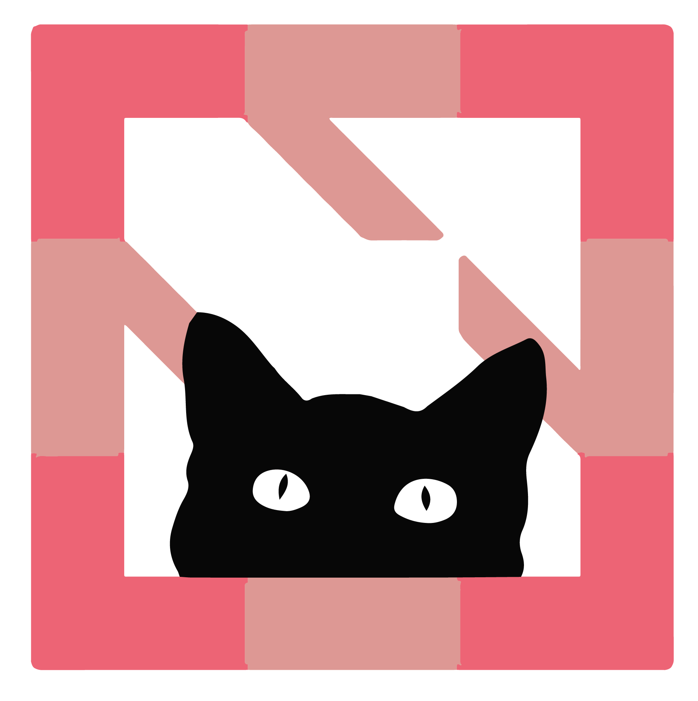
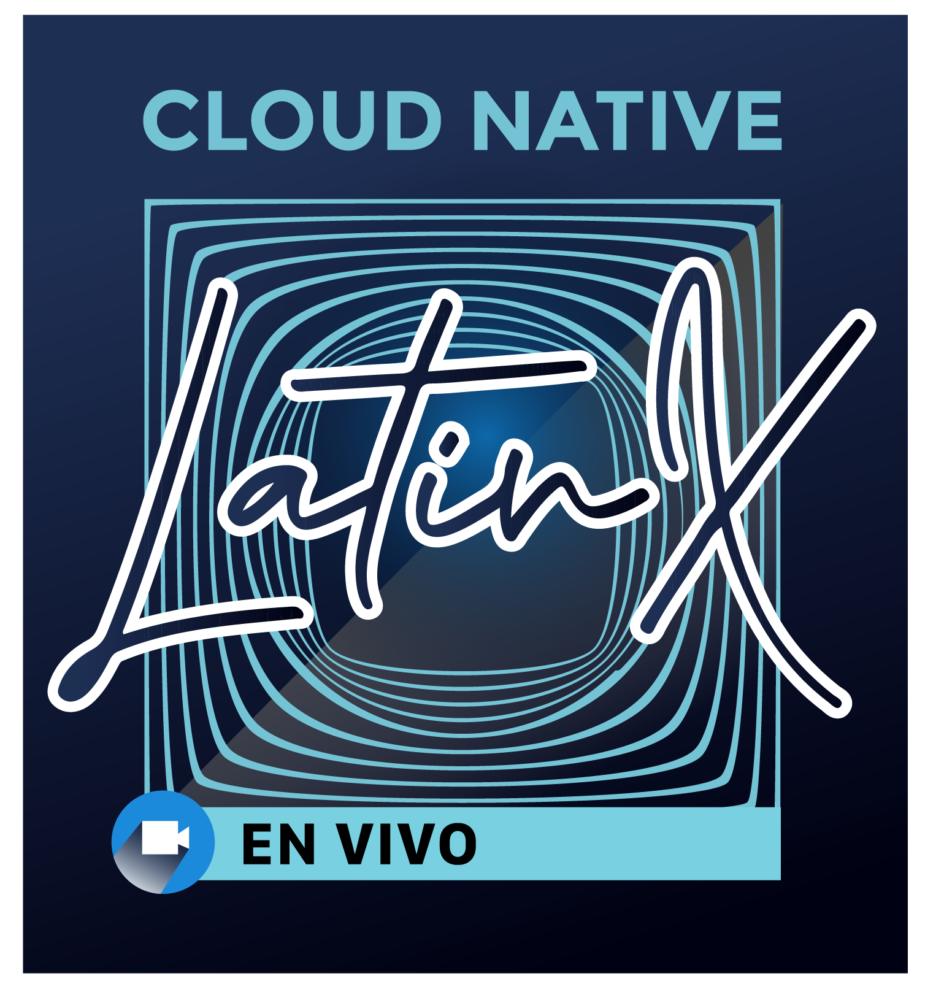
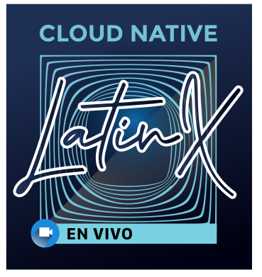
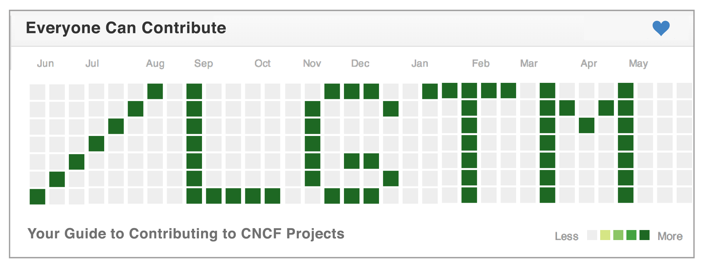
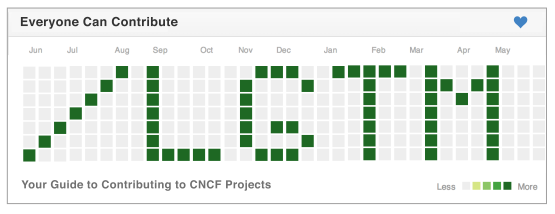

## CloudNative.tv Logos

In this repo, we have artwork in standard formats for the CloudNative.tv shows. We prepare artwork in 2 formats (PNG & SVG). With many browsers, you can right click and copy the logo of your choice below. Please note that although PNG is more common, SVG file sizes are smaller, supported in all modern web browsers, and a high-resolution format suitable for both print and high-resolution computer screens.

You can find t-shirts, hoodies and stickers for CloudNative.tv shows at the CNCF [store](https://store.cncf.io/). For questions about using terms in text, please see the CNCF [Style Guide](https://github.com/cncf/foundation/blob/master/style-guide.md).

* [CloudNative.tv](#cloudnativetv)
* [Current Shows](#current-shows)
  * [Certs Magic](#certs-magic)
  * [Cloud Native Classroom](#cloud-native-classroom)
  * [Cloud Native LatinX](cloud-native-latinx)
  * [CNCFaceOff](#cncfaceoff)
  * [Fields Tested](#fields-tested)
  * [LGTM](#lgtm)
  * [Solid State](#solid-state)
  * [Spotlight Live](#spotlight-live)
  * [This Week in Cloud Native](#this-week-in-cloud-native)
* Retired Shows
  * [100 Days](#100-days)

#### CloudNative.tv

<table>
  <tr>
   <td>PNG
   </td>
   <td>SVG
   </td>
  </tr>
  <tr>
   <td></td>
   <td></td>
  </tr>
</table>

### Current Shows

#### Certs Magic

<table>
  <tr>
   <td>PNG
   </td>
   <td>SVG
   </td>
  </tr>
  <tr>
   <td></td>
   <td></td>
  </tr>
</table>

#### Cloud Native Classroom

<table>
  <tr>
   <td>PNG
   </td>
   <td>SVG
   </td>
  </tr>
  <tr>
   <td></td>
   <td></td>
  </tr>
</table>

#### Cloud Native LatinX

<table>
  <tr>
   <td>PNG
   </td>
   <td>SVG
   </td>
  </tr>
  <tr>
   <td></td>
   <td></td>
  </tr>
</table>

#### CNCFaceOff

<table>
  <tr>
   <td>PNG
   </td>
   <td>SVG
   </td>
  </tr>
  <tr>
   <td></td>
   <td></td>
  </tr>
</table>

#### Fields Tested

<table>
  <tr>
   <td>PNG
   </td>
   <td>SVG
   </td>
  </tr>
  <tr>
   <td></td>
   <td></td>
  </tr>
</table>

#### LGTM

<table>
  <tr>
   <td>PNG
   </td>
   <td>SVG
   </td>
  </tr>
  <tr>
   <td></td>
   <td></td>
  </tr>
</table>

#### Solid State

<table>
  <tr>
   <td>PNG
   </td>
   <td>SVG
   </td>
  </tr>
  <tr>
   <td></td>
   <td></td>
  </tr>
</table>

#### Spotlight Live

<table>
  <tr>
   <td>PNG
   </td>
   <td>SVG
   </td>
  </tr>
  <tr>
   <td></td>
   <td></td>
  </tr>
</table>

#### This Week in Cloud Native

<table>
  <tr>
   <td>PNG
   </td>
   <td>SVG
   </td>
  </tr>
  <tr>
   <td></td>
   <td></td>
  </tr>
</table>

### Retired Shows

#### 100 Days

<table>
  <tr>
   <td>PNG
   </td>
   <td>SVG
   </td>
  </tr>
  <tr>
   <td></td>
   <td></td>
  </tr>
</table>
