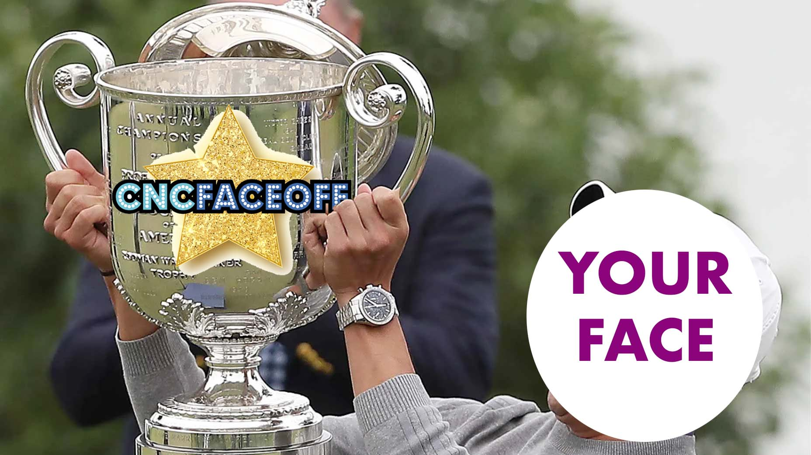
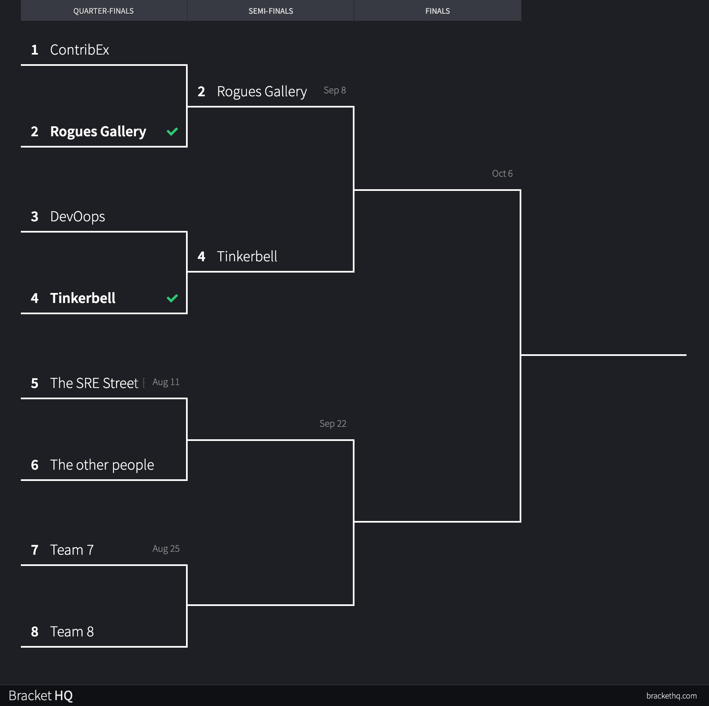

# CNCFaceOff

This is a live-streamed game show, similar to [Family Feud](https://en.wikipedia.org/wiki/Family_Feud), but with cloud-native/tech type questions. The game will stream live other Wednesday (starting 16 June) at 20:00 UTC on https://www.twitch.tv/cloudnativefdn. Each "season" will have 8 teams, who will compete with each other in an ongoing bracket, with the final winner being crowned champion. The winning team is awarded a huge amount of bragging rights, as well as the CNCFaceOff Cup. We can't show you what the Cup will look like, but trust us, it will be awesome. 

The show is hosted by [Matt Stratton](https://twitter.com/mattstratton), who is also one of the creator/hosts of [DevOps Party Games](https://devopspartygames.com).

## General gameplay

Each team will "face off" against each other, trying to guess what the most popular replies were to questions shared via a public survey. Some example questions might include:

- What text editor do you use the most frequently?
- Name a type of variable
- Something someone would find installed on your phone

Remember - as a player, you aren't answering these questions, but guessing what you think the most common replies to them would be!

## What's in it for me?

Did we mention the CNCFaceOff Cup? Plus, lots of bragging rights.

But seriously, this is a great way to get the word out about your CNCF project, and it will also be a lot of fun.

## Creating and submitting a team to play

Players will join from 19:30 to 20:30 UTC on the day of their episode.

Teams will be made up of three players. If you have a team ready to go (three people including yourself) you can submit your team using [this form](https://forms.gle/LssTENWEiAMyWrR29) or via email to cncfaceoff@mattstratton.com.

Note: Submitting this form is not a guarantee of appearance on the show - we will follow up with each team to confirm and to schedule your episode!

Questions? Contact [@mattstratton](https://twitter.com/mattstratton) on Twitter or email matty@cncfaceoff.tv.

### Artist's Rendering of the CNCFaceOff Cup

## Schedule and Results

| Episode             | Date      | Team 1    | Team 2         | Winner         |
|---------------------|-----------|-----------|----------------|----------------|
| Round 1                   | 7/14/2021 | ~~ContribEx~~ | Rogues Gallery | Rogues Gallery |
| Round 2                   | 7/28/2021 | DevOops   | Tinkerbell     |                |
| Round 3                   | 8/11/2021 | Team 5    | Team 6         |                |
| Round 4                   | 8/25/2021 | Team 7    | Team 8         |                |
| Semi-Finals Round 1 | 9/8/2021  |           |                |                |
| Semi-Finals Round 2 | 9/22/2021 |           |                |                |
| Finals              | 10/6/2021  |           |                |                |

